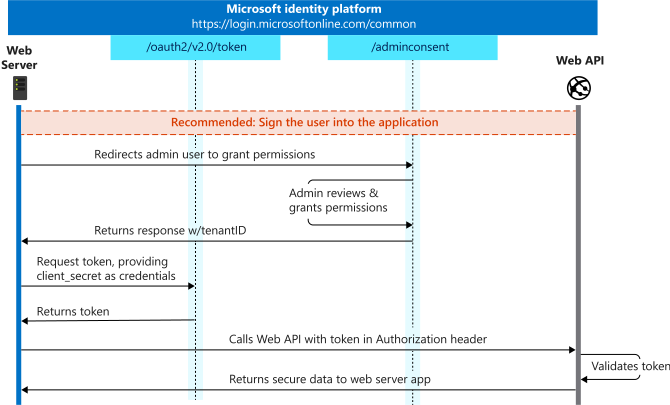

# Identity PoC Hack in Java
A Hack to develop PoCs using Java to leverage Azure AD and Azure AD B2C identities. 

## Goals
1. Develop a PoC that signs-in, signs-up, and signs-out a user with Azure AD B2C using MSAL Java.
2. Develop a PoC that signs-in, signs-up, and signs-out a user with Azure AD using MSAL Java.
   
## Agenda
| Day 1 | Day2 | Day 3 | Day 4 | Day 5 |
| --- | --- | --- | --- | --- | 
| **1:00pm - 1:15pm**: Kickoff and Team Intros <br> **1:15pm - 3:00pm**: [MS Identity Primer](https://github.com/becheng/ms-external-identities-primer) + AAD/B2C Demo <br> **3:15pm - 3:30pm**: Break <br> **3:15pm - 4pm**: Partner Environment Overview and Setup | **1pm - 2:30pm**: Team whiteboarding session + Demo of AAD/B2C Java Webapp Sample <br> **2:30pm - 2:45pm**: Break <br> **2:45pm - 4:00pm**: Hack | **1:00pm - 2:00pm**: Hack <br> **2:00pm - 2:15pm**: Break <br> **2:15pm - 4:00pm**: Hack | **1:00pm - 2:00pm**: Hack <br> **2:00pm - 2:15pm**: Break <br> **2:15pm - 4:00pm**: Hack | **1:00pm - 2:15pm**: Hack <br> **2:15pm - 3:00pm**: Closing & Lessons Learned

## PoC 1: Identity with AAD B2C
### Objective 1: Environment Setup
1. Provision an AAD B2C tenant
2. Register an B2C app  
3. Create and test 3 user flows: *Sign up & sign in*, *Profile Editing*, *Password Reset* using a B2C Local Account 

References: 
- [Create a AAD B2C tenant](https://docs.microsoft.com/en-us/azure/active-directory-b2c/tutorial-create-tenant)
- [Register an app in AAD B2C](https://docs.microsoft.com/en-us/azure/active-directory-b2c/tutorial-register-applications?tabs=app-reg-ga)
- [Create user flows in AAD B2C](https://docs.microsoft.com/en-us/azure/active-directory-b2c/tutorial-create-user-flows)


### Objective 2: Configure B2C External IDPs
1. Register an app with a social IDP, e.g. Google and add it as social IDP to your B2C tenant.  
2. Register an app with OIDC IDP, e.g. Partner's org AAD tenant and add it as a custom OIDC IDP to your B2C tenant. 
3. Retest your user flows with the new IDPs.

References:
- [Configure Google as AAD B2C IDP](https://docs.microsoft.com/en-us/azure/active-directory-b2c/identity-provider-google)
- [Configure AAD org as AAD B2C IDP](https://docs.microsoft.com/en-us/azure/active-directory-b2c/identity-provider-azure-ad-single-tenant)


### Objective 3: Secure Java app with AAD B2C
1. Protect target pages with auth server, aka require a user to sign up/in 
2. Redeem auth code for access token
3. Issue silent login to handle token expiration
4. Validate auth request and responses, i.e 'state', 'nonce', etc. *

CheckList
- [ ] Setup local environment, i.e. create a self-signed cert to support https on localhost
  ```
  Example:  
  keytool -genkeypair -alias testCert -keyalg RSA -storetype PKCS12 -keystore keystore.p12 -storepass password

  server.ssl.key-store-type=PKCS12  
  server.ssl.key-store=classpath:keystore.p12  
  server.ssl.key-store-password=password  
  server.ssl.key-alias=testCert
  ```
- [ ] Configuration file + class
- [ ] Check user is authenticated on secure pages 
- [ ] Prompt user for sign in if not authenticated
- [ ] Handle auth code response from auth server to redeem it for an access token.
- [ ] Validate state and nonce to protect against attacks, cross-site scripting, etc.

*Hint*: if not calling a downstream webapi, use the client Id as a scope to generate an access token.
References:
- [MSAL4J workaround if just sign-in](https://github.com/AzureAD/microsoft-authentication-library-for-java/issues/140)
- [Public vs Confidential client apps](https://docs.microsoft.com/en-us/azure/active-directory/develop/msal-client-applications) 

### Objective 4: Call a downstream protected web api 
1. Call a api protected by same auth server with a scope

References: 
- [Configure an app to expose an api](https://docs.microsoft.com/en-us/azure/active-directory/develop/quickstart-configure-app-expose-web-apis)
- [Configure an app to access a web api](https://docs.microsoft.com/en-us/azure/active-directory/develop/quickstart-configure-app-access-web-apis)
  
<!-- 
### * Objective 5: Custom attributes/claims in the User flows
TODO   

### * Objective 6: UI Customization
TODO   

### * Challenge 7: Custom Policies
TODO

* = *Nice to haves*   
-->

## PoC 2: *Rinse and Repeat* using AAD

### Objective 1: Environment Setup
1. Provision a *separate* AAD tenant.
2. Register an AAD app as a *multi-tenant app*.  

References:
- [Create a new AAD tenant](https://docs.microsoft.com/en-us/azure/active-directory/fundamentals/active-directory-access-create-new-tenant) 
- [Register an AAD app](https://docs.microsoft.com/en-us/azure/active-directory/develop/quickstart-register-app)

### Objective 2: Secure Java app with AAD
1. Rinse and repeat steps in the B2C PoC or just clone above with some minor tweaks.

References: 
- [Force revoke of token (for testing silent login)](https://docs.microsoft.com/en-us/azure/active-directory/enterprise-users/users-revoke-access)

### Objective 3: Call a downstream protected web api 
1. Call a api protected by same auth server with a scope

## Resources
- MSAL Java Library: https://github.com/AzureAD/microsoft-authentication-library-for-java
- Microsoft Identity Java Webapp Sample: https://github.com/Azure-Samples/ms-identity-java-webapp
- VSCode IDE: https://code.visualstudio.com/
- VSCode Java Extension Pack: https://marketplace.visualstudio.com/items?itemName=vscjava.vscode-java-pack
- VSCode Spring Book Extension Pack: https://marketplace.visualstudio.com/items?itemName=Pivotal.vscode-boot-dev-pack
- Spring Initalizr: https://start.spring.io/

## Key OAuth Flows ##

### Auth Code Flow

Ref: https://docs.microsoft.com/en-us/azure/active-directory/develop/v2-oauth2-auth-code-flow

### Client Credentials Flow

Ref: https://docs.microsoft.com/en-us/azure/active-directory/develop/v2-oauth2-client-creds-grant-flow
